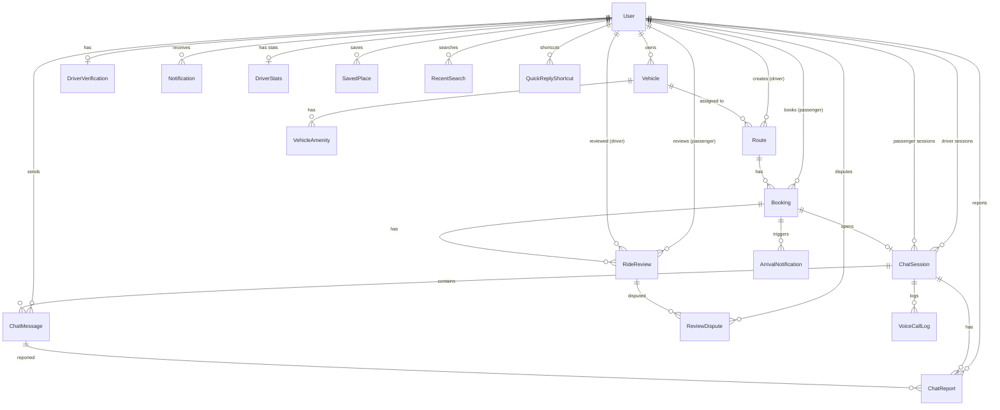

# 📦 Database Schema Documentation

> **Drive To Survive** — Ride-Sharing Platform  
> **Database**: MySQL (`csse4469_db`)  
> **ORM**: Prisma 6.19  
> **Schema Path**: `DriveToSurviveWebApp/server/prisma/schema.prisma`

---

## สารบัญ

1. [ER Diagram](#er-diagram)
2. [Enums](#enums)
3. [Models — Sprint 1 (Core)](#models--sprint-1-core)
4. [Models — Sprint 2 (Chat, Review, Notification)](#models--sprint-2)
5. [Models — Places & Location](#models--places--location)
6. [Models — System & Compliance](#models--system--compliance)
7. [Indexes & Constraints](#indexes--constraints)

---

## ER Diagram



---

## Enums

### Role

| Value       | Description         |
| ----------- | ------------------- |
| `PASSENGER` | ผู้โดยสาร (default) |
| `DRIVER`    | คนขับ               |
| `ADMIN`     | ผู้ดูแลระบบ         |

### VerificationStatus

| Value      | Description         |
| ---------- | ------------------- |
| `PENDING`  | รอตรวจสอบ (default) |
| `APPROVED` | อนุมัติแล้ว         |
| `REJECTED` | ปฏิเสธ              |

### RouteStatus

| Value        | Description       |
| ------------ | ----------------- |
| `AVAILABLE`  | เปิดจอง (default) |
| `FULL`       | เต็มแล้ว          |
| `COMPLETED`  | เดินทางเสร็จ      |
| `CANCELLED`  | ยกเลิก            |
| `IN_TRANSIT` | กำลังเดินทาง      |

### BookingStatus

| Value         | Description        |
| ------------- | ------------------ |
| `PENDING`     | รอยืนยัน (default) |
| `CONFIRMED`   | ยืนยันแล้ว         |
| `REJECTED`    | ปฏิเสธ             |
| `CANCELLED`   | ยกเลิก             |
| `IN_PROGRESS` | กำลังเดินทาง       |
| `COMPLETED`   | เสร็จสิ้น          |
| `NO_SHOW`     | ไม่มาตามนัด        |

### CancelReason

| Value                      | Description            |
| -------------------------- | ---------------------- |
| `CHANGE_OF_PLAN`           | เปลี่ยนแผน             |
| `FOUND_ALTERNATIVE`        | พบทางเลือกอื่น         |
| `DRIVER_DELAY`             | คนขับล่าช้า            |
| `PRICE_ISSUE`              | ปัญหาราคา              |
| `WRONG_LOCATION`           | สถานที่ผิด             |
| `DUPLICATE_OR_WRONG_DATE`  | ซ้ำ/วันที่ผิด          |
| `SAFETY_CONCERN`           | ความปลอดภัย            |
| `WEATHER_OR_FORCE_MAJEURE` | สภาพอากาศ/เหตุสุดวิสัย |
| `COMMUNICATION_ISSUE`      | ปัญหาการสื่อสาร        |

### LicenseType

| Value                   | Description       |
| ----------------------- | ----------------- |
| `PRIVATE_CAR_TEMPORARY` | ใบขับขี่ชั่วคราว  |
| `PRIVATE_CAR`           | ใบขับขี่ส่วนบุคคล |
| `PUBLIC_CAR`            | ใบขับขี่สาธารณะ   |
| `LIFETIME`              | ใบขับขี่ตลอดชีพ   |

### NotificationType

| Value          | Description    |
| -------------- | -------------- |
| `SYSTEM`       | ระบบ (default) |
| `VERIFICATION` | ยืนยันตัวตน    |
| `BOOKING`      | การจอง         |
| `ROUTE`        | เส้นทาง        |
| `CHAT`         | แชท            |
| `ARRIVAL`      | ใกล้ถึง        |
| `REVIEW`       | รีวิว          |

### ChatSessionStatus

| Value       | Description                         |
| ----------- | ----------------------------------- |
| `ACTIVE`    | กำลังใช้งาน (default)               |
| `ENDED`     | จบทริปแล้ว — ยังคุยต่อได้ 1 วัน     |
| `READ_ONLY` | อ่านอย่างเดียว — อีก 7 วันจะถูกลบ   |
| `ARCHIVED`  | ลบข้อความแล้ว — เก็บ log ใน ChatLog |

### MessageType

| Value         | Description             |
| ------------- | ----------------------- |
| `TEXT`        | ข้อความ (default)       |
| `IMAGE`       | รูปภาพ (Cloudinary URL) |
| `LOCATION`    | แชร์ตำแหน่ง             |
| `QUICK_REPLY` | ตอบกลับด่วน             |
| `SYSTEM`      | ข้อความระบบ             |

### RadiusType

| Value     | Description        |
| --------- | ------------------ |
| `FIVE_KM` | แจ้งเตือน 5 กม.    |
| `ONE_KM`  | แจ้งเตือน 1 กม.    |
| `ZERO_KM` | ถึงแล้ว            |
| `MANUAL`  | แจ้งเตือนด้วยตนเอง |

### ReviewStatus

| Value        | Description        |
| ------------ | ------------------ |
| `ACTIVE`     | แสดงอยู่ (default) |
| `ANONYMIZED` | ทำให้ไม่ระบุตัวตน  |
| `HIDDEN`     | ซ่อน (Admin)       |

### DisputeStatus

| Value      | Description         |
| ---------- | ------------------- |
| `PENDING`  | รอตรวจสอบ (default) |
| `RESOLVED` | แก้ไขแล้ว           |
| `REJECTED` | ปฏิเสธ              |

### ReportStatus

| Value       | Description         |
| ----------- | ------------------- |
| `PENDING`   | รอตรวจสอบ (default) |
| `REVIEWED`  | ตรวจสอบแล้ว         |
| `DISMISSED` | ยกเลิก              |

### ReportReason

| Value               | Description           |
| ------------------- | --------------------- |
| `HARASSMENT`        | คุกคาม/ข่มขู่         |
| `SPAM`              | สแปม                  |
| `INAPPROPRIATE`     | เนื้อหาไม่เหมาะสม     |
| `PRIVACY_VIOLATION` | ละเมิดความเป็นส่วนตัว |
| `OTHER`             | อื่นๆ                 |

### DisputeReason

| Value          | Description    |
| -------------- | -------------- |
| `FAKE_REVIEW`  | รีวิวปลอม      |
| `WRONG_PERSON` | ผิดคน          |
| `INACCURATE`   | ไม่ตรงความจริง |
| `OFFENSIVE`    | หยาบคาย        |
| `OTHER`        | อื่นๆ          |

---

## Models — Sprint 1 (Core)

### User

ตารางผู้ใช้หลัก — ทั้งผู้โดยสาร, คนขับ, และแอดมิน

| Column                    | Type          | Constraints          | Description             |
| ------------------------- | ------------- | -------------------- | ----------------------- |
| `id`                      | String (CUID) | PK                   | รหัสผู้ใช้              |
| `username`                | String        | Unique               | ชื่อผู้ใช้              |
| `email`                   | String        | Unique               | อีเมล                   |
| `password`                | String        | —                    | รหัสผ่าน (bcrypt)       |
| `firstName`               | String?       | —                    | ชื่อจริง                |
| `lastName`                | String?       | —                    | นามสกุล                 |
| `gender`                  | String?       | —                    | เพศ                     |
| `phoneNumber`             | String?       | —                    | เบอร์โทร                |
| `profilePicture`          | String?       | —                    | URL รูปโปรไฟล์          |
| `nationalIdNumber`        | String?       | Unique               | เลขบัตรประชาชน          |
| `nationalIdPhotoUrl`      | String?       | Unique, VARCHAR(500) | URL รูปบัตรด้านหน้า     |
| `nationalIdBackPhotoUrl`  | String?       | VARCHAR(500)         | URL รูปบัตรด้านหลัง     |
| `nationalIdBackNumber`    | String?       | —                    | เลขบัตรด้านหลัง         |
| `nationalIdExpiryDate`    | DateTime?     | —                    | วันหมดอายุบัตร          |
| `nationalIdOcrData`       | Json?         | —                    | ข้อมูล OCR              |
| `selfiePhotoUrl`          | String?       | VARCHAR(500)         | URL รูป selfie          |
| `role`                    | Role          | Default: PASSENGER   | บทบาท                   |
| `isVerified`              | Boolean       | Default: false       | ยืนยันตัวตนแล้ว         |
| `verifiedByOcr`           | Boolean       | Default: false       | ยืนยันผ่าน OCR          |
| `isActive`                | Boolean       | Default: true        | สถานะการใช้งาน          |
| `otpCode`                 | String?       | —                    | รหัส OTP                |
| `otpExpiry`               | DateTime?     | —                    | หมดอายุ OTP             |
| `lastLogin`               | DateTime?     | —                    | เข้าสู่ระบบล่าสุด       |
| `createdAt`               | DateTime      | Default: now()       | วันสมัคร                |
| `updatedAt`               | DateTime      | Auto                 | อัปเดตล่าสุด            |
| `deletedAt`               | DateTime?     | —                    | Soft delete (PDPA ม.33) |
| `passengerSuspendedUntil` | DateTime?     | —                    | ระงับผู้โดยสารถึง       |
| `driverSuspendedUntil`    | DateTime?     | —                    | ระงับคนขับถึง           |

**Relations**: DriverVerification, Vehicle[], Notification[], Route[] (driver), Booking[] (passenger), ChatSession[] (driver/passenger), ChatMessage[], ChatReport[], RideReview[] (passenger/driver), DriverStats, ReviewDispute[], SavedPlace[], RecentSearch[], QuickReplyShortcut[]

**Indexes**: `role`, `isActive`, `isVerified`, `createdAt`, `deletedAt`

---

### DriverVerification

ข้อมูลยืนยันตัวตนคนขับ

| Column               | Type               | Constraints       | Description       |
| -------------------- | ------------------ | ----------------- | ----------------- |
| `id`                 | String (CUID)      | PK                | —                 |
| `userId`             | String             | FK → User, Unique | ผู้ใช้            |
| `licenseNumber`      | String             | Unique            | เลขใบขับขี่       |
| `firstNameOnLicense` | String             | —                 | ชื่อบนใบขับขี่    |
| `lastNameOnLicense`  | String             | —                 | นามสกุลบนใบขับขี่ |
| `licenseIssueDate`   | DateTime           | —                 | วันออกใบขับขี่    |
| `licenseExpiryDate`  | DateTime           | —                 | วันหมดอายุ        |
| `licensePhotoUrl`    | String             | VARCHAR(500)      | รูปใบขับขี่       |
| `selfiePhotoUrl`     | String             | VARCHAR(500)      | รูป selfie        |
| `typeOnLicense`      | LicenseType        | —                 | ประเภทใบขับขี่    |
| `ocrData`            | Json?              | —                 | ข้อมูล OCR        |
| `verifiedByOcr`      | Boolean            | Default: false    | ยืนยันผ่าน OCR    |
| `status`             | VerificationStatus | Default: PENDING  | สถานะ             |
| `createdAt`          | DateTime           | Default: now()    | —                 |
| `updatedAt`          | DateTime           | Auto              | —                 |

**Indexes**: `status`, `createdAt`, `licenseIssueDate`, `licenseExpiryDate`

---

### Vehicle

ข้อมูลยานพาหนะ

| Column         | Type          | Constraints    | Description  |
| -------------- | ------------- | -------------- | ------------ |
| `id`           | String (CUID) | PK             | —            |
| `userId`       | String        | FK → User      | เจ้าของ      |
| `vehicleModel` | String        | —              | รุ่นรถ       |
| `licensePlate` | String        | Unique         | ทะเบียนรถ    |
| `vehicleType`  | String        | —              | ประเภทรถ     |
| `color`        | String        | —              | สี           |
| `seatCapacity` | Int           | —              | จำนวนที่นั่ง |
| `photos`       | Json?         | —              | รูปถ่ายรถ    |
| `isDefault`    | Boolean       | Default: false | รถหลัก       |
| `createdAt`    | DateTime      | Default: now() | —            |
| `updatedAt`    | DateTime      | Auto           | —            |

**Relations**: VehicleAmenity[], Route[]

**Indexes**: `userId`, `createdAt`, `vehicleType`, `seatCapacity`

---

### VehicleAmenity

สิ่งอำนวยความสะดวกในรถ (แทน String[] ที่ MySQL ไม่รองรับ)

| Column      | Type   | Constraints         | Description            |
| ----------- | ------ | ------------------- | ---------------------- |
| `id`        | Int    | PK (Auto Increment) | —                      |
| `vehicleId` | String | FK → Vehicle        | —                      |
| `name`      | String | —                   | ชื่อเช่น "WiFi", "USB" |

---

### Notification

การแจ้งเตือนผู้ใช้

| Column            | Type             | Constraints     | Description        |
| ----------------- | ---------------- | --------------- | ------------------ |
| `id`              | String (CUID)    | PK              | —                  |
| `userId`          | String           | FK → User       | ผู้รับ             |
| `type`            | NotificationType | Default: SYSTEM | ประเภท             |
| `title`           | String           | —               | หัวข้อ             |
| `body`            | String           | Text            | เนื้อหา            |
| `link`            | String?          | —               | ลิงก์              |
| `metadata`        | Json?            | —               | ข้อมูลเพิ่มเติม    |
| `readAt`          | DateTime?        | —               | อ่านเมื่อ          |
| `createdAt`       | DateTime         | Default: now()  | —                  |
| `adminReviewedAt` | DateTime?        | —               | Admin ตรวจสอบเมื่อ |

**Indexes**: `[userId, createdAt]`, `[userId, readAt]`, `adminReviewedAt`

---

### Route

เส้นทางที่คนขับสร้าง

| Column            | Type          | Constraints        | Description                             |
| ----------------- | ------------- | ------------------ | --------------------------------------- |
| `id`              | String (CUID) | PK                 | —                                       |
| `driverId`        | String        | FK → User          | คนขับ                                   |
| `vehicleId`       | String        | FK → Vehicle       | รถ                                      |
| `startLocation`   | Json          | —                  | จุดเริ่มต้น `{name, address, lat, lng}` |
| `endLocation`     | Json          | —                  | จุดหมาย `{name, address, lat, lng}`     |
| `departureTime`   | DateTime      | —                  | เวลาออก                                 |
| `availableSeats`  | Int           | —                  | ที่นั่งว่าง                             |
| `pricePerSeat`    | Float         | —                  | ราคาต่อที่นั่ง                          |
| `conditions`      | String?       | Text               | เงื่อนไข                                |
| `status`          | RouteStatus   | Default: AVAILABLE | สถานะ                                   |
| `cancelledAt`     | DateTime?     | —                  | วันยกเลิก                               |
| `cancelledBy`     | String?       | —                  | ยกเลิกโดย                               |
| `routePolyline`   | String?       | MediumText         | เส้นทาง encoded                         |
| `distanceMeters`  | Int?          | —                  | ระยะทาง (เมตร)                          |
| `durationSeconds` | Int?          | —                  | เวลา (วินาที)                           |
| `routeSummary`    | String?       | Text               | สรุปเส้นทาง                             |
| `distance`        | String?       | —                  | ระยะทาง (text)                          |
| `duration`        | String?       | —                  | เวลา (text)                             |
| `waypoints`       | Json?         | —                  | จุดแวะ                                  |
| `landmarks`       | Json?         | —                  | จุดสังเกต                               |
| `steps`           | Json?         | —                  | ขั้นตอนการเดินทาง                       |
| `createdAt`       | DateTime      | Default: now()     | —                                       |
| `updatedAt`       | DateTime      | Auto               | —                                       |

**Relations**: Booking[]

**Indexes**: `driverId`, `vehicleId`, `status`, `createdAt`, `departureTime`

---

### Booking

การจองที่นั่ง

| Column            | Type          | Constraints      | Description                             |
| ----------------- | ------------- | ---------------- | --------------------------------------- |
| `id`              | String (CUID) | PK               | —                                       |
| `routeId`         | String        | FK → Route       | เส้นทาง                                 |
| `passengerId`     | String        | FK → User        | ผู้โดยสาร                               |
| `numberOfSeats`   | Int           | —                | จำนวนที่นั่ง                            |
| `status`          | BookingStatus | Default: PENDING | สถานะ                                   |
| `cancelledAt`     | DateTime?     | —                | วันยกเลิก                               |
| `cancelledBy`     | String?       | —                | ยกเลิกโดย                               |
| `cancelReason`    | CancelReason? | —                | เหตุผลยกเลิก                            |
| `pickupLocation`  | Json          | —                | จุดรับ                                  |
| `dropoffLocation` | Json          | —                | จุดส่ง                                  |
| `completedAt`     | DateTime?     | —                | เสร็จเมื่อ (สำหรับ review window 7 วัน) |
| `noShowDeadline`  | DateTime?     | —                | กำหนด No-Show                           |
| `createdAt`       | DateTime      | Default: now()   | —                                       |

**Relations**: ChatSession?, ArrivalNotification[], RideReview[]

---

## Models — Sprint 2

### ChatSession

ห้องแชทระหว่างคนขับกับผู้โดยสาร — ผูกกับ Booking

| Column               | Type              | Constraints          | Description                         |
| -------------------- | ----------------- | -------------------- | ----------------------------------- |
| `id`                 | String (CUID)     | PK                   | —                                   |
| `bookingId`          | String            | FK → Booking, Unique | การจองที่ผูก                        |
| `driverId`           | String            | FK → User            | คนขับ                               |
| `passengerId`        | String            | FK → User            | ผู้โดยสาร                           |
| `status`             | ChatSessionStatus | Default: ACTIVE      | สถานะ                               |
| `createdAt`          | DateTime          | Default: now()       | —                                   |
| `endedAt`            | DateTime?         | —                    | จบทริปเมื่อ                         |
| `chatExpiresAt`      | DateTime?         | —                    | endedAt + 1 วัน → เปลี่ยน READ_ONLY |
| `readOnlyExpiresAt`  | DateTime?         | —                    | endedAt + 8 วัน → เปลี่ยน ARCHIVED  |
| `retentionExpiresAt` | DateTime          | —                    | now + 90 วัน                        |

**Relations**: ChatMessage[], VoiceCallLog[], ChatReport[]

**Indexes**: `driverId`, `passengerId`, `status`, `retentionExpiresAt`, `chatExpiresAt`, `readOnlyExpiresAt`

**Lifecycle**:

```
ACTIVE → trip active, ส่งข้อความได้ปกติ
  ↓ endSession()
ENDED → ยังคุยต่อได้ 1 วัน (chatExpiresAt)
  ↓ CRON (1 วันผ่านไป)
READ_ONLY → อ่านได้อย่างเดียว 7 วัน (readOnlyExpiresAt)
  ↓ CRON (7 วันผ่านไป)
ARCHIVED → ข้อความถูกลบ, เก็บ log ใน ChatLog
```

---

### ChatMessage

ข้อความในแชท

| Column            | Type          | Constraints      | Description                         |
| ----------------- | ------------- | ---------------- | ----------------------------------- |
| `id`              | String (CUID) | PK               | —                                   |
| `sessionId`       | String        | FK → ChatSession | ห้องแชท                             |
| `senderId`        | String        | FK → User        | ผู้ส่ง                              |
| `type`            | MessageType   | Default: TEXT    | ประเภทข้อความ                       |
| `content`         | String        | Text             | เนื้อหา (ผ่าน content filter)       |
| `imageUrl`        | String?       | VARCHAR(500)     | URL รูปภาพ (Cloudinary)             |
| `originalContent` | String?       | Text             | เนื้อหาดั้งเดิม (ก่อน filter)       |
| `isFiltered`      | Boolean       | Default: false   | ถูกกรองเนื้อหา                      |
| `isUnsent`        | Boolean       | Default: false   | ถูกยกเลิกส่ง                        |
| `unsendDeadline`  | DateTime?     | —                | created + 5 นาที                    |
| `metadata`        | Json?         | —                | ข้อมูลเพิ่ม (lat/lng, template key) |
| `createdAt`       | DateTime      | Default: now()   | —                                   |

**Relations**: ChatReport[]

**Indexes**: `[sessionId, createdAt]`, `senderId`

---

### VoiceCallLog

บันทึกการโทร (สำรอง)

| Column               | Type          | Constraints        | Description                                  |
| -------------------- | ------------- | ------------------ | -------------------------------------------- |
| `id`                 | String (CUID) | PK                 | —                                            |
| `sessionId`          | String        | FK → ChatSession   | —                                            |
| `callerId`           | String        | —                  | ผู้โทร                                       |
| `receiverId`         | String        | —                  | ผู้รับ                                       |
| `duration`           | Int           | Default: 0         | วินาที                                       |
| `status`             | String        | Default: INITIATED | INITIATED/RINGING/CONNECTED/COMPLETED/MISSED |
| `createdAt`          | DateTime      | Default: now()     | —                                            |
| `endedAt`            | DateTime?     | —                  | —                                            |
| `retentionExpiresAt` | DateTime      | —                  | now + 90 วัน                                 |

---

### ChatReport

รายงานข้อความ

| Column       | Type          | Constraints      | Description         |
| ------------ | ------------- | ---------------- | ------------------- |
| `id`         | String (CUID) | PK               | —                   |
| `sessionId`  | String        | FK → ChatSession | —                   |
| `messageId`  | String        | FK → ChatMessage | ข้อความที่ถูกรายงาน |
| `reporterId` | String        | FK → User        | ผู้รายงาน           |
| `reason`     | ReportReason  | —                | เหตุผล              |
| `detail`     | String?       | Text             | รายละเอียด          |
| `status`     | ReportStatus  | Default: PENDING | สถานะ               |
| `adminNote`  | String?       | Text             | หมายเหตุ Admin      |
| `createdAt`  | DateTime      | Default: now()   | —                   |

**Constraints**: `@@unique([messageId, reporterId])` — ป้องกันรายงานซ้ำ

---

### QuickReplyShortcut

คีย์ลัดตอบกลับด่วน — กำหนดเองโดยผู้ใช้

| Column      | Type          | Constraints    | Description    |
| ----------- | ------------- | -------------- | -------------- |
| `id`        | String (CUID) | PK             | —              |
| `userId`    | String        | FK → User      | เจ้าของ        |
| `text`      | String        | VARCHAR(200)   | ข้อความคีย์ลัด |
| `sortOrder` | Int           | Default: 0     | ลำดับ          |
| `createdAt` | DateTime      | Default: now() | —              |

**Business Rules**: สูงสุด 20 รายการต่อ user

---

### ChatLog

Archive ข้อความแชทสำหรับ Admin — เก็บ snapshot ก่อนลบอัตโนมัติ

| Column            | Type          | Constraints    | Description             |
| ----------------- | ------------- | -------------- | ----------------------- |
| `id`              | String (CUID) | PK             | —                       |
| `sessionId`       | String        | —              | session ที่ถูก archive  |
| `driverId`        | String        | —              | คนขับ                   |
| `passengerId`     | String        | —              | ผู้โดยสาร               |
| `messages`        | Json          | —              | snapshot ข้อความทั้งหมด |
| `archivedAt`      | DateTime      | Default: now() | วันที่ archive          |
| `originalEndedAt` | DateTime?     | —              | วันจบทริปจริง           |

**Indexes**: `sessionId`, `driverId`, `passengerId`, `archivedAt`

---

### ArrivalNotification

แจ้งเตือนใกล้ถึงจุดรับ

| Column        | Type          | Constraints    | Description        |
| ------------- | ------------- | -------------- | ------------------ |
| `id`          | String (CUID) | PK             | —                  |
| `bookingId`   | String        | FK → Booking   | —                  |
| `driverId`    | String        | —              | —                  |
| `passengerId` | String        | —              | —                  |
| `radiusType`  | RadiusType    | —              | ระยะแจ้งเตือน      |
| `driverLat`   | Float?        | —              | ตำแหน่งคนขับ       |
| `driverLon`   | Float?        | —              | ตำแหน่งคนขับ       |
| `appStatus`   | String        | Default: SENT  | สถานะการส่ง in-app |
| `emailStatus` | String        | Default: SENT  | สถานะการส่งอีเมล   |
| `triggeredAt` | DateTime      | Default: now() | —                  |

**Constraints**: `@@unique([bookingId, radiusType])` — 1 notification per radius per booking

---

### NotificationLog

Log การส่งการแจ้งเตือนทุกช่องทาง

| Column        | Type     | Constraints         | Description            |
| ------------- | -------- | ------------------- | ---------------------- |
| `id`          | Int      | PK (Auto Increment) | —                      |
| `type`        | String   | VARCHAR(50)         | ARRIVAL, CHAT, REVIEW  |
| `channel`     | String   | VARCHAR(20)         | APP, EMAIL, APP+EMAIL  |
| `recipientId` | String   | —                   | ผู้รับ                 |
| `bookingId`   | String?  | —                   | —                      |
| `payload`     | Json?    | —                   | ข้อมูลบริบท            |
| `status`      | String   | VARCHAR(30)         | SENT, FAILED, RETRYING |
| `createdAt`   | DateTime | Default: now()      | —                      |

---

### RideReview

รีวิวการเดินทาง — Immutable (ไม่สามารถแก้ไข)

| Column            | Type          | Constraints     | Description                           |
| ----------------- | ------------- | --------------- | ------------------------------------- |
| `id`              | String (CUID) | PK              | —                                     |
| `bookingId`       | String        | FK → Booking    | —                                     |
| `passengerId`     | String        | FK → User       | ผู้รีวิว                              |
| `driverId`        | String        | FK → User       | คนขับที่ถูกรีวิว                      |
| `rating`          | Int           | —               | 1-5 ดาว                               |
| `tags`            | Json?         | —               | แท็ก เช่น "polite", "safe_driving"    |
| `comment`         | String?       | Text            | ความคิดเห็น (profanity-filtered)      |
| `privateFeedback` | String?       | Text            | ข้อเสนอแนะส่วนตัว (คนขับเห็นเท่านั้น) |
| `isAnonymous`     | Boolean       | Default: false  | ไม่ระบุตัวตน                          |
| `displayName`     | String        | Default: ""     | ชื่อที่แสดง                           |
| `status`          | ReviewStatus  | Default: ACTIVE | สถานะ                                 |
| `createdAt`       | DateTime      | Default: now()  | —                                     |

**Constraints**: `@@unique([bookingId, passengerId])` — 1 review ต่อ booking ต่อ passenger

**Business Rules**: ต้องรีวิวภายใน 7 วันหลัง completedAt

---

### ReviewDispute

การโต้แย้งรีวิว (โดยคนขับ)

| Column       | Type          | Constraints      | Description     |
| ------------ | ------------- | ---------------- | --------------- |
| `id`         | String (CUID) | PK               | —               |
| `reviewId`   | String        | FK → RideReview  | รีวิวที่โต้แย้ง |
| `driverId`   | String        | FK → User        | คนขับ           |
| `reason`     | DisputeReason | —                | เหตุผล          |
| `detail`     | String        | Text             | รายละเอียด      |
| `status`     | DisputeStatus | Default: PENDING | สถานะ           |
| `adminNote`  | String?       | Text             | หมายเหตุ Admin  |
| `resolvedAt` | DateTime?     | —                | แก้ไขเมื่อ      |
| `createdAt`  | DateTime      | Default: now()   | —               |

**Constraints**: `@@unique([reviewId, driverId])` — 1 dispute ต่อ review ต่อ driver

---

### DriverStats

สถิติรวมคนขับ (Denormalized สำหรับ performance)

| Column         | Type          | Constraints       | Description                   |
| -------------- | ------------- | ----------------- | ----------------------------- |
| `id`           | String (CUID) | PK                | —                             |
| `driverId`     | String        | FK → User, Unique | คนขับ                         |
| `totalRides`   | Int           | Default: 0        | จำนวนเที่ยวทั้งหมด            |
| `totalReviews` | Int           | Default: 0        | จำนวนรีวิวทั้งหมด             |
| `avgRating`    | Float         | Default: 0        | คะแนนเฉลี่ย                   |
| `tagCounts`    | Json?         | —                 | นับแท็ก `{"polite": 10, ...}` |
| `updatedAt`    | DateTime      | Auto              | —                             |

---

## Models — Places & Location

### SavedPlace

สถานที่บันทึกไว้ (บ้าน, ที่ทำงาน, custom)

| Column      | Type          | Constraints    | Description                |
| ----------- | ------------- | -------------- | -------------------------- |
| `id`        | String (CUID) | PK             | —                          |
| `userId`    | String        | FK → User      | —                          |
| `label`     | String        | —              | "บ้าน", "ที่ทำงาน", custom |
| `name`      | String        | —              | ชื่อสถานที่                |
| `address`   | String?       | Text           | ที่อยู่เต็ม                |
| `lat`       | Float         | —              | ละติจูด                    |
| `lng`       | Float         | —              | ลองจิจูด                   |
| `placeId`   | String?       | —              | Google Place ID            |
| `icon`      | String?       | Default: "pin" | home, work, star, pin      |
| `sortOrder` | Int           | Default: 0     | ลำดับ                      |
| `createdAt` | DateTime      | Default: now() | —                          |
| `updatedAt` | DateTime      | Auto           | —                          |

**Constraints**: `@@unique([userId, label])` — upsert by label

---

### RecentSearch

ประวัติค้นหาล่าสุด

| Column    | Type          | Constraints    | Description     |
| --------- | ------------- | -------------- | --------------- |
| `id`      | String (CUID) | PK             | —               |
| `userId`  | String        | FK → User      | —               |
| `name`    | String        | —              | ชื่อสถานที่     |
| `address` | String?       | Text           | ที่อยู่         |
| `lat`     | Float         | —              | ละติจูด         |
| `lng`     | Float         | —              | ลองจิจูด        |
| `placeId` | String?       | —              | Google Place ID |
| `usedAt`  | DateTime      | Default: now() | ใช้ล่าสุดเมื่อ  |

**Business Rules**: auto-prune สูงสุด 20 รายการ, dedup by name

---

## Models — System & Compliance

### SystemLog

บันทึกจราจรคอมพิวเตอร์ — **Immutable** ตาม พ.ร.บ.คอมพิวเตอร์ พ.ศ. 2560 มาตรา 26

| Column        | Type     | Constraints         | Description                |
| ------------- | -------- | ------------------- | -------------------------- |
| `id`          | Int      | PK (Auto Increment) | —                          |
| `userId`      | String?  | —                   | ผู้ใช้ (ถ้ามี)             |
| `ipAddress`   | String?  | VARCHAR(45)         | IP (รองรับ IPv6)           |
| `action`      | String   | VARCHAR(50)         | HTTP Method / admin action |
| `resource`    | String?  | Text                | Request URL                |
| `userAgent`   | String?  | Text                | Browser/Device info        |
| `entity`      | String?  | VARCHAR(50)         | เช่น User, Booking         |
| `entityId`    | String?  | VARCHAR(100)        | —                          |
| `performedBy` | String?  | —                   | Admin userId               |
| `detail`      | String?  | Text                | รายละเอียด                 |
| `createdAt`   | DateTime | Default: now()      | —                          |

**Indexes**: `userId`, `createdAt`, `action`, `ipAddress`, `entity`

**Retention**: เก็บไม่น้อยกว่า 90 วัน

---

### Blacklist

รายชื่อผู้ถูกแบน — เก็บเฉพาะ SHA-256 Hash (PDPA พ.ศ. 2562 มาตรา 22)

| Column             | Type     | Constraints                  | Description               |
| ------------------ | -------- | ---------------------------- | ------------------------- |
| `id`               | Int      | PK (Auto Increment)          | —                         |
| `nationalIdHash`   | String   | Unique, VARCHAR(64)          | SHA-256 Hash ของเลขบัตร   |
| `reason`           | String?  | Text                         | เหตุผล                    |
| `bannedRole`       | String   | Default: "BOTH", VARCHAR(10) | PASSENGER / DRIVER / BOTH |
| `createdByAdminId` | String   | —                            | Admin ที่แบน              |
| `createdAt`        | DateTime | Default: now()               | —                         |

---

## Indexes & Constraints

### Unique Constraints

| Table               | Columns                    | Purpose               |
| ------------------- | -------------------------- | --------------------- |
| User                | `username`                 | ชื่อผู้ใช้ไม่ซ้ำ      |
| User                | `email`                    | อีเมลไม่ซ้ำ           |
| User                | `nationalIdNumber`         | เลขบัตรไม่ซ้ำ         |
| Vehicle             | `licensePlate`             | ทะเบียนรถไม่ซ้ำ       |
| DriverVerification  | `licenseNumber`            | เลขใบขับขี่ไม่ซ้ำ     |
| ChatSession         | `bookingId`                | 1 แชทต่อ 1 booking    |
| ChatReport          | `[messageId, reporterId]`  | ป้องกันรายงานซ้ำ      |
| ArrivalNotification | `[bookingId, radiusType]`  | 1 แจ้งเตือนต่อ radius |
| RideReview          | `[bookingId, passengerId]` | 1 รีวิวต่อ booking    |
| ReviewDispute       | `[reviewId, driverId]`     | 1 dispute ต่อ review  |
| SavedPlace          | `[userId, label]`          | upsert by label       |
| Blacklist           | `nationalIdHash`           | ไม่ซ้ำกัน             |

### Cascade Delete

ทุก relation ใช้ `onDelete: Cascade` — เมื่อ parent ถูกลบ child จะถูกลบตาม

### Compliance

| กฎหมาย                               | การปฏิบัติตาม                       | ตาราง     |
| ------------------------------------ | ----------------------------------- | --------- |
| **PDPA พ.ศ. 2562 ม.22**              | เก็บเฉพาะ Hash, ไม่เก็บข้อมูลดิบ    | Blacklist |
| **PDPA พ.ศ. 2562 ม.33**              | Soft delete (deletedAt)             | User      |
| **พ.ร.บ.คอมพิวเตอร์ พ.ศ. 2560 ม.26** | เก็บ traffic log 90+ วัน, Immutable | SystemLog |
