# 📖 คู่มือการใช้งานระบบ Ride — เดินทางร่วมกันอย่างปลอดภัย

> **เวอร์ชัน:** Sprint 2 | **อัปเดตล่าสุด:** 4 มีนาคม 2569

---

## สารบัญ

1. [การเข้าสู่ระบบ (Login)](#1-การเข้าสู่ระบบ-login)
2. [หน้าหลักหลังเข้าสู่ระบบ](#2-หน้าหลักหลังเข้าสู่ระบบ)
3. [การสร้างเส้นทาง (Create Route)](#3-การสร้างเส้นทาง-create-route)
4. [การค้นหาเส้นทาง (Find Trip)](#4-การค้นหาเส้นทาง-find-trip)
5. [การจองเส้นทาง (Book Trip)](#5-การจองเส้นทาง-book-trip)
6. [การอนุมัติเส้นทาง (Approve Booking)](#6-การอนุมัติเส้นทาง-approve-booking)
7. [การจัดการเส้นทางของฉัน (My Trips)](#7-การจัดการเส้นทางของฉัน-my-trips)
8. [การใช้แชทสื่อสาร (Chat)](#8-การใช้แชทสื่อสาร-chat)
9. [การแชร์ตำแหน่ง (Share Location)](#9-การแชร์ตำแหน่ง-share-location)
10. [การเดินทางไปรับผู้โดยสาร & ร่วมทริป](#10-การเดินทางไปรับผู้โดยสาร--ร่วมทริป)
11. [การกดส่งผู้โดยสาร & จบทริป](#11-การกดส่งผู้โดยสาร--จบทริป)
12. [ผู้โดยสารรีวิว (Review)](#12-ผู้โดยสารรีวิว-review)
13. [การจัดการโปรไฟล์ (Profile)](#13-การจัดการโปรไฟล์-profile)
14. [การแจ้งเตือน (Notifications)](#14-การแจ้งเตือน-notifications)

---

## 1. การเข้าสู่ระบบ (Login)

### ขั้นตอนการเข้าสู่ระบบ

1. เปิดเว็บเบราว์เซอร์แล้วไปที่หน้าเข้าสู่ระบบ
2. จะเห็นหน้า Login พร้อมฟอร์มกรอกข้อมูล

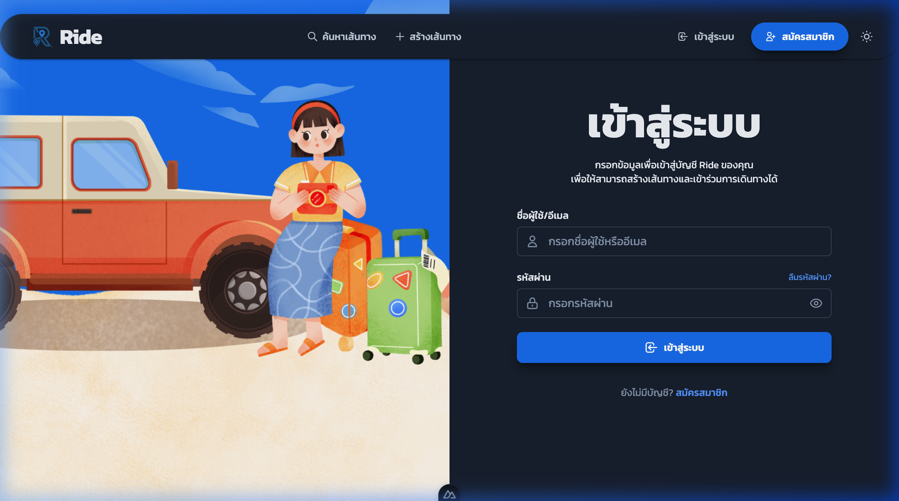

3. กรอก **ชื่อผู้ใช้/อีเมล** และ **รหัสผ่าน** ในช่องที่กำหนด

   | ช่อง             | ตัวอย่างข้อมูล                                          |
   | ---------------- | ------------------------------------------------------- |
   | ชื่อผู้ใช้/อีเมล | `epic2driver` (คนขับ) หรือ `epic2passenger` (ผู้โดยสาร) |
   | รหัสผ่าน         | `Cp12345678`                                            |


4. คลิกปุ่ม **"เข้าสู่ระบบ"**
5. หากข้อมูลถูกต้อง ระบบจะนำไปยังหน้าหลัก

> **หมายเหตุ:** หากยังไม่มีบัญชี สามารถกดลิงก์ **"สมัครสมาชิก"** เพื่อสร้างบัญชีใหม่ หรือกด **"ลืมรหัสผ่าน?"** เพื่อรีเซ็ตรหัสผ่าน

---

## 2. หน้าหลักหลังเข้าสู่ระบบ

เมื่อเข้าสู่ระบบสำเร็จ จะเห็นหน้าหลักของแอปพลิเคชัน Ride พร้อมเมนูหลักดังนี้:

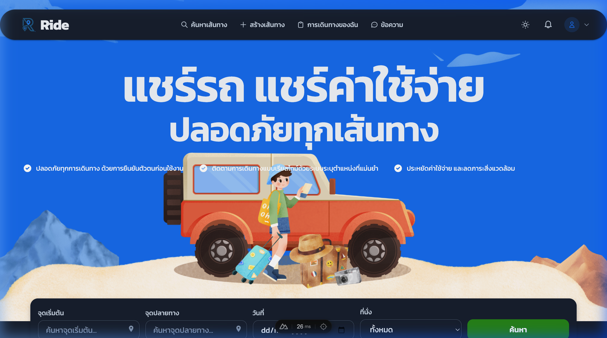

### เมนูหลัก (Navigation Bar)

| เมนู                    | คำอธิบาย                              |
| ----------------------- | ------------------------------------- |
| 🔍 **ค้นหาเส้นทาง**     | ค้นหาเส้นทางที่เปิดให้จองจากคนขับ     |
| ➕ **สร้างเส้นทาง**     | สร้างเส้นทางใหม่ (สำหรับคนขับ)        |
| 📋 **การเดินทางของฉัน** | ดูรายการเส้นทางที่สร้าง/จองไว้ทั้งหมด |
| 💬 **ข้อความ**          | แชทระหว่างคนขับและผู้โดยสาร           |
| 🔔 **แจ้งเตือน**        | การแจ้งเตือนต่าง ๆ ของระบบ            |

### ส่วนค้นหาเส้นทางด่วน (Quick Search)

ที่ด้านล่างของ Hero Section มีแถบค้นหาเส้นทาง โดยกรอก:

- **จุดเริ่มต้น** — สถานที่ต้นทาง
- **จุดปลายทาง** — สถานที่ปลายทาง
- **วันที่** — วันที่ต้องการเดินทาง
- **ที่นั่ง** — จำนวนที่นั่งที่ต้องการ
- กดปุ่ม **"ค้นหา"** เพื่อดูผลลัพธ์

---

## 3. การสร้างเส้นทาง (Create Route)

> ⚙️ **สำหรับคนขับเท่านั้น** — ต้องผ่านการยืนยันตัวตนและลงทะเบียนรถยนต์แล้ว

### ขั้นตอนที่ 1: เปิดหน้าสร้างเส้นทาง

คลิกเมนู **"+ สร้างเส้นทาง"** ที่ Navigation Bar จะเห็นหน้าฟอร์มสร้างเส้นทาง พร้อมแผนที่

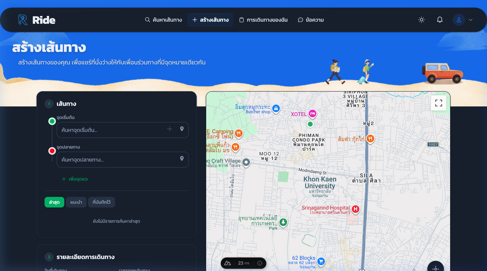

### ขั้นตอนที่ 2: กำหนดเส้นทาง

ฟอร์มแบ่งเป็น 4 ส่วน:

#### ส่วนที่ 1 — เส้นทาง

1. กรอก **จุดเริ่มต้น** ในช่อง "ค้นหาจุดเริ่มต้น..." — ระบบจะแสดงรายการแนะนำจาก Google Maps ให้เลือก
2. กรอก **จุดปลายทาง** ในช่อง "ค้นหาจุดปลายทาง..."
3. หากต้องการเพิ่มจุดแวะระหว่างทาง สามารถกด **"+ เพิ่มจุดแวะ"**

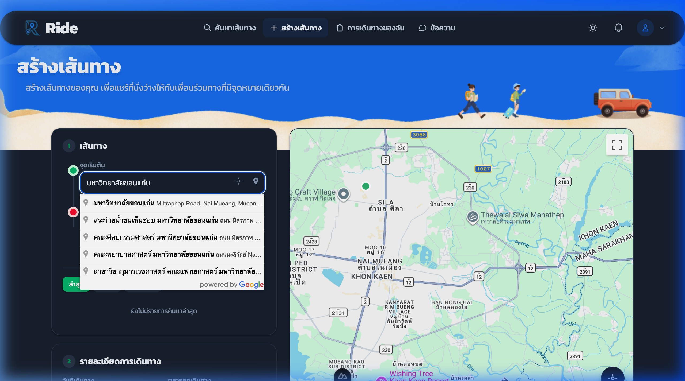

> **เคล็ดลับ:** พิมพ์ชื่อสถานที่เป็นภาษาไทยหรืออังกฤษได้ ระบบจะค้นหาผ่าน Google Maps และแสดงผลพร้อมที่อยู่เต็ม

#### ส่วนที่ 2 — รายละเอียดการเดินทาง

| ช่อง             | คำอธิบาย                    | ตัวอย่าง   |
| ---------------- | --------------------------- | ---------- |
| วันที่เดินทาง    | วันที่ออกเดินทาง            | 10/03/2569 |
| เวลาออกเดินทาง   | เวลาออกจากจุดเริ่มต้น       | 08:00      |
| ที่นั่งว่าง      | จำนวนที่นั่งที่เปิดให้จอง   | 4          |
| ราคา/ที่นั่ง (฿) | ค่าใช้จ่ายต่อผู้โดยสาร 1 คน | 250        |

#### ส่วนที่ 3 — ข้อมูลรถยนต์

- เลือกรถยนต์จากรายการที่ลงทะเบียนไว้ (เช่น Toyota Camry (กข 1234))
- หากยังไม่มีรถ สามารถกด **"+ เพิ่ม / จัดการรถยนต์"** เพื่อเพิ่มข้อมูลรถ

#### ส่วนที่ 4 — เงื่อนไข

กรอกเงื่อนไขเพิ่มเติม เช่น "ไม่สูบบุหรี่, สัมภาระไม่เกิน 20 กก."

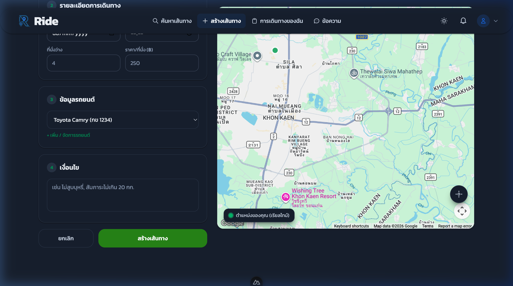

### ขั้นตอนที่ 3: ยืนยันสร้างเส้นทาง

- ตรวจสอบข้อมูลทั้งหมดให้ถูกต้อง
- กดปุ่ม **"สร้างเส้นทาง"** (ปุ่มสีเขียว)
- หากต้องการยกเลิก กดปุ่ม **"ยกเลิก"**
- เมื่อสร้างสำเร็จ เส้นทางจะปรากฏในหน้า "การเดินทางของฉัน" และผู้โดยสารสามารถค้นหาและจองได้

---

## 4. การค้นหาเส้นทาง (Find Trip)

> 🔍 **สำหรับผู้โดยสาร** — ค้นหาเส้นทางที่คนขับเปิดให้จอง

### ขั้นตอน

1. คลิกเมนู **"🔍 ค้นหาเส้นทาง"** ที่ Navigation Bar
2. จะเห็นหน้าค้นหาพร้อมฟอร์มกรอง

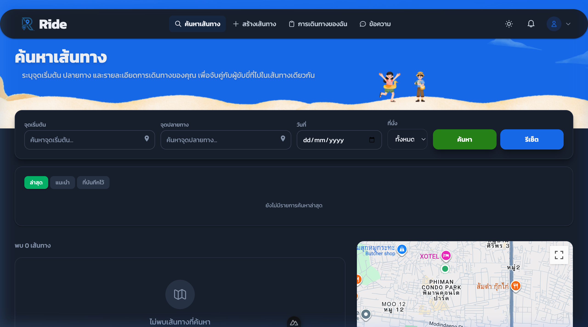

3. กรอกข้อมูลในแถบค้นหา:
   - **จุดเริ่มต้น** — พิมพ์ชื่อสถานที่ต้นทาง
   - **จุดปลายทาง** — พิมพ์ชื่อสถานที่ปลายทาง
   - **วันที่** — เลือกวันที่ต้องการเดินทาง
   - **ที่นั่ง** — เลือกจำนวนที่นั่ง หรือเลือก "ทั้งหมด"
4. กดปุ่ม **"ค้นหา"** (สีเขียว) หรือ **"รีเซ็ต"** (สีน้ำเงิน) เพื่อล้างตัวกรอง

### แท็บผลลัพธ์

| แท็บ             | คำอธิบาย                      |
| ---------------- | ----------------------------- |
| **ล่าสุด**       | เส้นทางที่เพิ่งสร้างล่าสุด    |
| **แนะนำ**        | เส้นทางที่แนะนำตามความสนใจ    |
| **ที่บันทึกไว้** | เส้นทางที่บันทึกเป็น Favorite |

- ผลลัพธ์จะแสดงเป็นรายการเส้นทาง พร้อมแสดงแผนที่ทางด้านขวา
- หากไม่พบเส้นทาง จะแสดงข้อความ **"ไม่พบเส้นทางที่ค้นหา"**

---

## 5. การจองเส้นทาง (Book Trip)

> 🎫 **สำหรับผู้โดยสาร** — จองที่นั่งในเส้นทางที่คนขับสร้างไว้

### ขั้นตอน

1. ค้นหาเส้นทางที่ต้องการจากหน้า **ค้นหาเส้นทาง**
2. คลิกที่การ์ดเส้นทางเพื่อดูรายละเอียด
3. ตรวจสอบข้อมูล:
   - ต้นทาง — ปลายทาง
   - วันที่และเวลาออกเดินทาง
   - จำนวนที่นั่งว่าง
   - ราคาต่อที่นั่ง
   - ข้อมูลรถยนต์และคนขับ
   - เงื่อนไขเพิ่มเติม
4. กดปุ่ม **"จองเส้นทาง"** หรือ **"ขอเข้าร่วม"**
5. ระบบจะส่งคำขอจองไปยังคนขับ
6. รอการอนุมัติจากคนขับ — สถานะจะเปลี่ยนเป็น **"รอการอนุมัติ"**

> **หมายเหตุ:** ผู้โดยสารจะได้รับการแจ้งเตือนเมื่อคนขับอนุมัติหรือปฏิเสธคำขอ

---

## 6. การอนุมัติเส้นทาง (Approve Booking)

> ✅ **สำหรับคนขับ** — อนุมัติหรือปฏิเสธคำขอจองจากผู้โดยสาร

### ขั้นตอน

1. เมื่อมีผู้โดยสารส่งคำขอจอง คนขับจะได้รับ **การแจ้งเตือน** (Notification)
2. ไปที่หน้า **"การเดินทางของฉัน"** > แท็บ **"คนขับ"**
3. คลิกเส้นทางที่มีคำขอจอง
4. ดูข้อมูลผู้โดยสารที่ขอจอง
5. เลือก:
   - ✅ **อนุมัติ** — ยอมรับผู้โดยสารเข้าร่วมทริป
   - ❌ **ปฏิเสธ** — ไม่ยอมรับผู้โดยสาร
6. เมื่ออนุมัติแล้ว:
   - จำนวนที่นั่งว่างจะลดลง
   - ระบบจะสร้าง **ห้องแชท** ให้คนขับและผู้โดยสารสื่อสารกันอัตโนมัติ
   - ผู้โดยสารจะได้รับแจ้งเตือนว่าได้รับการอนุมัติแล้ว

---

## 7. การจัดการเส้นทางของฉัน (My Trips)

### ขั้นตอน

1. คลิกเมนู **"📋 การเดินทางของฉัน"** ที่ Navigation Bar

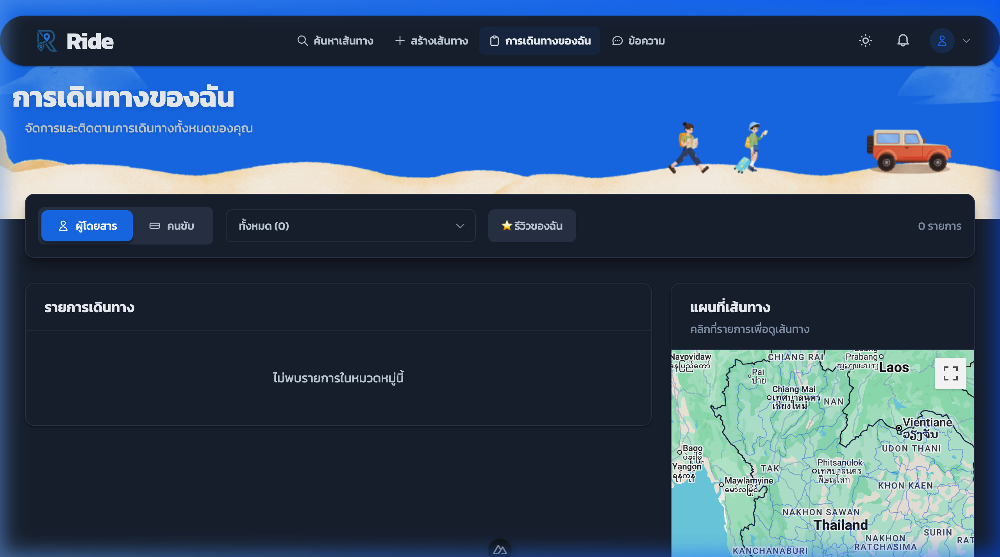

2. เลือกแท็บตามบทบาท:

   | แท็บ             | คำอธิบาย                                 |
   | ---------------- | ---------------------------------------- |
   | **👤 ผู้โดยสาร** | เส้นทางที่จองหรือเข้าร่วมในฐานะผู้โดยสาร |
   | **🚗 คนขับ**     | เส้นทางที่สร้างในฐานะคนขับ               |

3. ใช้ **ตัวกรองสถานะ** เพื่อกรองเส้นทาง (เช่น ทั้งหมด, รอการอนุมัติ, กำลังเดินทาง, เสร็จสิ้น)

4. กดปุ่ม **"⭐ รีวิวของฉัน"** เพื่อดูรีวิวทั้งหมด

### สถานะของทริป

| สถานะ            | ความหมาย                               |
| ---------------- | -------------------------------------- |
| **รอการอนุมัติ** | ผู้โดยสารส่งคำขอจองแล้ว รอคนขับอนุมัติ |
| **อนุมัติแล้ว**  | คนขับอนุมัติคำขอแล้ว พร้อมเดินทาง      |
| **กำลังเดินทาง** | ทริปเริ่มต้นแล้ว อยู่ระหว่างเดินทาง    |
| **เสร็จสิ้น**    | ทริปจบลงแล้ว                           |
| **ยกเลิก**       | ทริปถูกยกเลิก                          |

### แผนที่เส้นทาง

ด้านขวาของหน้าจะแสดง **แผนที่เส้นทาง** เมื่อคลิกเลือกเส้นทางในรายการ จะแสดงเส้นทางบนแผนที่

---

## 8. การใช้แชทสื่อสาร (Chat)

> 💬 ระบบแชทจะสร้างขึ้นอัตโนมัติเมื่อคนขับอนุมัติผู้โดยสาร

### ขั้นตอน

1. คลิกเมนู **"💬 ข้อความ"** ที่ Navigation Bar

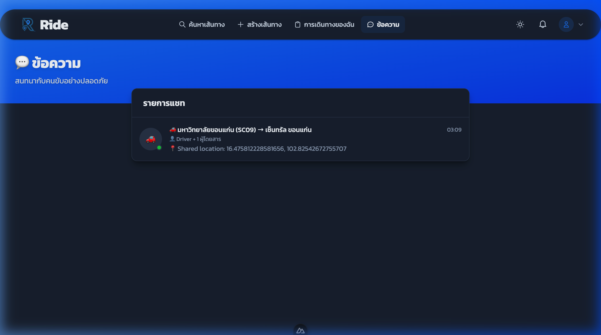

2. จะเห็น **รายการแชท** ที่แสดง:
   - ชื่อเส้นทาง (เช่น "มหาวิทยาลัยขอนแก่น (SC09) → เซ็นทรัล ขอนแก่น")
   - จำนวนสมาชิก (Driver + ผู้โดยสาร)
   - ข้อความล่าสุด
   - เวลาของข้อความล่าสุด

3. คลิกที่แชทเพื่อเปิดห้องสนทนา

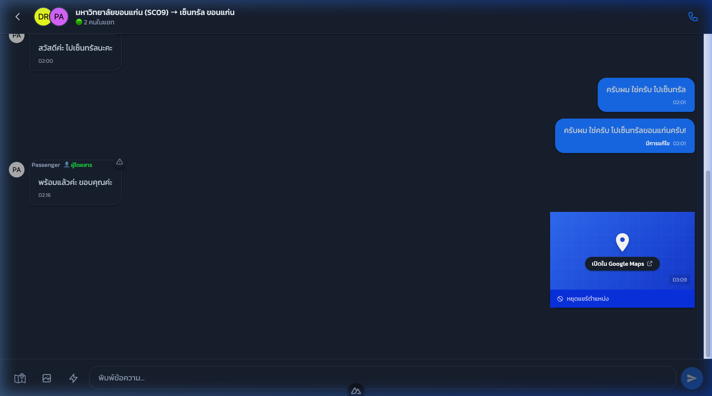

### ฟีเจอร์ในห้องแชท

| ฟีเจอร์            | คำอธิบาย                                                           |
| ------------------ | ------------------------------------------------------------------ |
| 💬 **ส่งข้อความ**  | พิมพ์ข้อความในช่อง "พิมพ์ข้อความ..." แล้วกดปุ่มส่ง (ไอคอนลูกศร)    |
| 📍 **แชร์ตำแหน่ง** | กดไอคอนตำแหน่งเพื่อแชร์ตำแหน่งปัจจุบัน (ดูรายละเอียดในหัวข้อถัดไป) |
| 📷 **ส่งรูปภาพ**   | กดไอคอนรูปภาพเพื่อแนบภาพ                                           |
| ⚡ **Quick Reply** | กดไอคอนสายฟ้าเพื่อใช้ข้อความด่วนสำเร็จรูป                          |
| 📋 **เมนูทริป**    | กดไอคอนเมนูเพื่อจัดการสถานะทริป                                    |
| 📞 **โทร**         | กดไอคอนโทรศัพท์ (มุมขวาบน)                                         |

### สังเกต

- ข้อความของตัวเอง จะอยู่ **ด้านขวา** (สีน้ำเงิน)
- ข้อความของคู่สนทนา จะอยู่ **ด้านซ้าย** (สีเทาเข้ม)
- ข้อความที่แก้ไขจะแสดง **"มีการแก้ไข"**
- แชทแสดงเวลาของทุกข้อความ

---

## 9. การแชร์ตำแหน่ง (Share Location)

> 📍 ฟีเจอร์แชร์ตำแหน่งช่วยให้คนขับและผู้โดยสารรู้ตำแหน่งของกันและกันแบบเรียลไทม์

### ขั้นตอนการแชร์ตำแหน่ง

1. เปิดห้องแชทของเส้นทางที่ต้องการ
2. กดไอคอน **📍 (ตำแหน่ง)** ที่แถบเครื่องมือด้านล่าง
3. อนุญาต Browser เข้าถึงตำแหน่ง (Allow Location)
4. ตำแหน่งปัจจุบันจะถูกแชร์ในแชท พร้อมลิงก์ **"เปิดใน Google Maps"**

### การดูตำแหน่งที่แชร์

- คลิก **"เปิดใน Google Maps"** เพื่อดูตำแหน่งบน Google Maps
- จะเห็นพิกัด (Latitude, Longitude) แสดงในข้อความ

### การหยุดแชร์ตำแหน่ง

- กดปุ่ม **"🚫 หยุดแชร์ตำแหน่ง"** ที่ด้านล่างของ Location Card

> **เคล็ดลับ:** แนะนำให้แชร์ตำแหน่งก่อนถึงจุดรับ เพื่อให้อีกฝ่ายรู้ว่าอยู่ที่ไหน

---

## 10. การเดินทางไปรับผู้โดยสาร & ร่วมทริป

### สำหรับคนขับ 🚗

1. เมื่อถึงเวลาเดินทาง เปิดห้องแชทของเส้นทาง
2. กดเมนูทริป (ไอคอน 📋) เลือก **"เริ่มเดินทาง"**
3. สถานะทริปจะเปลี่ยนเป็น **"กำลังเดินทาง"**
4. **แชร์ตำแหน่ง** เพื่อให้ผู้โดยสารติดตามได้
5. เดินทางไปรับผู้โดยสารตามจุดที่กำหนด
6. เมื่อรับผู้โดยสารแล้ว กด **"รับผู้โดยสารแล้ว"** หรือ **"Picked up"**

### สำหรับผู้โดยสาร 🧑‍🤝‍🧑

1. ตรวจสอบสถานะทริปในหน้า **"การเดินทางของฉัน"**
2. เมื่อทริปเริ่ม เปิดแชทเพื่อสื่อสารกับคนขับ
3. ดูตำแหน่งของคนขับผ่าน **Location ที่แชร์** ในแชท
4. รอคนขับมารับที่จุดนัดพบ

### ระหว่างเดินทาง

- ทั้งคนขับและผู้โดยสารสามารถ **แชทสื่อสาร** ได้ตลอดเส้นทาง
- สามารถ **แชร์ตำแหน่งเรียลไทม์** เพื่ออัปเดตสถานะ
- ระบบจะแสดง **แผนที่ติดตามเส้นทาง** ในหน้า Tracking

---

## 11. การกดส่งผู้โดยสาร & จบทริป

### สำหรับคนขับ 🚗

1. เมื่อถึงจุดหมายปลายทาง เปิดห้องแชท
2. กดเมนูทริป (ไอคอน 📋) เลือก **"ส่งผู้โดยสาร"**
3. ระบบจะอัปเดตสถานะผู้โดยสาร
4. เมื่อส่งผู้โดยสารทุกคนแล้ว กด **"จบทริป"**
5. สถานะทริปจะเปลี่ยนเป็น **"เสร็จสิ้น"**

### สำหรับผู้โดยสาร 🧑‍🤝‍🧑

1. เมื่อถึงจุดหมาย ผู้โดยสารจะเห็นสถานะเปลี่ยน
2. ระบบจะเปิดให้ **เขียนรีวิว** คนขับ

> **สำคัญ:** ทริปจะจบได้ต่อเมื่อคนขับกด "จบทริป" เท่านั้น

---

## 12. ผู้โดยสารรีวิว (Review)

> ⭐ เมื่อทริปจบลง ผู้โดยสารสามารถรีวิวและให้คะแนนคนขับได้

### ขั้นตอน

1. หลังทริปจบ ระบบจะแสดงปุ่มให้รีวิว
2. หรือไปที่เมนู **"⭐ รีวิวของฉัน"** ในหน้าการเดินทางของฉัน

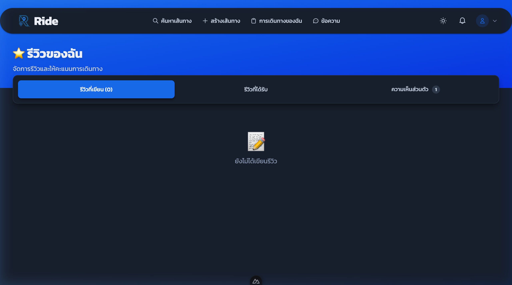

### แท็บในหน้ารีวิว

| แท็บ                | คำอธิบาย                             |
| ------------------- | ------------------------------------ |
| **รีวิวที่เขียน**   | รีวิวที่เราเขียนให้คนอื่น            |
| **รีวิวที่ได้รับ**  | รีวิวที่คนอื่นเขียนให้เรา            |
| **ความเห็นส่วนตัว** | ข้อเสนอแนะส่วนตัว (Private Feedback) |

### การเขียนรีวิว

1. กดปุ่ม **"เขียนรีวิว"** ในทริปที่เสร็จสิ้น
2. ให้คะแนนดาว (1-5 ⭐)
3. พิมพ์ความคิดเห็น (Comment)
4. หากมีข้อเสนอแนะส่วนตัว สามารถเขียนใน **Private Feedback** ที่เฉพาะฝ่ายนั้นเห็น
5. กดปุ่มยืนยันเพื่อส่งรีวิว

> **หมายเหตุ:** รีวิวจะแสดงเป็นสาธารณะในโปรไฟล์ของคนขับ ส่วน Private Feedback จะเห็นเฉพาะฝ่ายที่ได้รับ

---

## 13. การจัดการโปรไฟล์ (Profile)

### ขั้นตอน

1. คลิกที่ **ไอคอนโปรไฟล์** (มุมขวาบน) แล้วเลือก "โปรไฟล์"

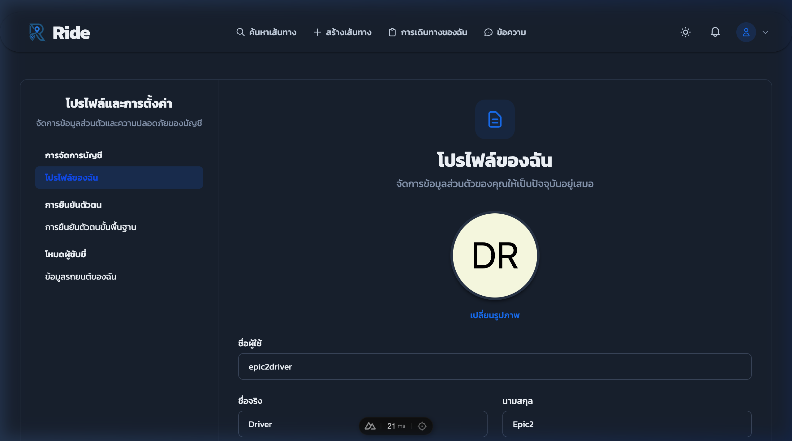

### เมนูในหน้าโปรไฟล์

| หมวดหมู่           | เมนู                      | คำอธิบาย                                                    |
| ------------------ | ------------------------- | ----------------------------------------------------------- |
| **การจัดการบัญชี** | โปรไฟล์ของฉัน             | แก้ไขข้อมูลส่วนตัว (ชื่อ, นามสกุล, อีเมล, เบอร์โทร, รูปภาพ) |
| **การยืนยันตัวตน** | การยืนยันตัวตนขั้นพื้นฐาน | อัปโหลดเอกสารยืนยันตัวตน (บัตรประชาชน, ใบขับขี่)            |
| **โหมดผู้ขับขี่**  | ข้อมูลรถยนต์ของฉัน        | จัดการข้อมูลรถยนต์ (เพิ่ม/แก้ไข/ลบ)                         |

### การแก้ไขโปรไฟล์

1. แก้ไขข้อมูลในฟอร์ม (ชื่อผู้ใช้, ชื่อจริง, นามสกุล)
2. กดปุ่ม **"เปลี่ยนรูปภาพ"** เพื่ออัปโหลดรูปโปรไฟล์
3. บันทึกการเปลี่ยนแปลง

---

## 14. การแจ้งเตือน (Notifications)

### ขั้นตอน

1. คลิกที่ **ไอคอนกระดิ่ง 🔔** ที่ Navigation Bar

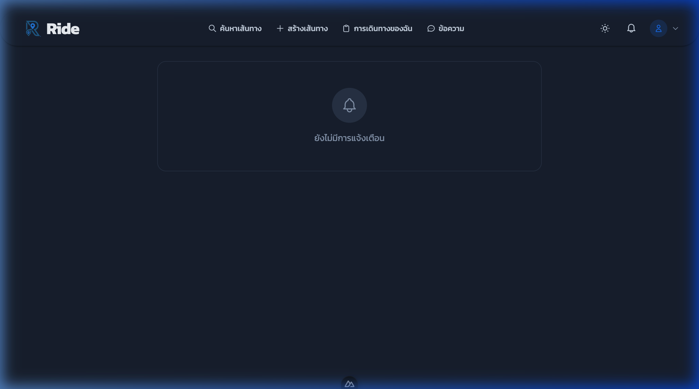

### ประเภทการแจ้งเตือน

| ประเภท             | เมื่อไหร่                     |
| ------------------ | ----------------------------- |
| **คำขอจองใหม่**    | มีผู้โดยสารต้องการจองเส้นทาง  |
| **อนุมัติ/ปฏิเสธ** | คนขับอนุมัติหรือปฏิเสธคำขอจอง |
| **เริ่มเดินทาง**   | ทริปเริ่มต้นแล้ว              |
| **ทริปจบ**         | ทริปเสร็จสิ้น                 |
| **ข้อความใหม่**    | มีข้อความใหม่ในแชท            |
| **รีวิวใหม่**      | มีรีวิวใหม่จากผู้โดยสาร/คนขับ |

---

## สรุป Flow การใช้งานทั้งหมด

```
┌─────────────────────────────────────────────────────────────────┐
│                    🚗 คนขับ (Driver)                            │
│                                                                 │
│  1. เข้าสู่ระบบ ──▶ 2. สร้างเส้นทาง ──▶ 3. รอผู้โดยสารจอง     │
│                                             │                   │
│  4. อนุมัติคำขอจอง ◀──────────────────────┘                   │
│         │                                                       │
│  5. เริ่มเดินทาง ──▶ 6. แชท/แชร์ตำแหน่ง                       │
│         │                                                       │
│  7. ไปรับผู้โดยสาร ──▶ 8. ร่วมเดินทาง                         │
│         │                                                       │
│  9. ส่งผู้โดยสาร ──▶ 10. จบทริป                                │
└─────────────────────────────────────────────────────────────────┘

┌─────────────────────────────────────────────────────────────────┐
│                   🧑‍🤝‍🧑 ผู้โดยสาร (Passenger)                     │
│                                                                 │
│  1. เข้าสู่ระบบ ──▶ 2. ค้นหาเส้นทาง ──▶ 3. จองเส้นทาง        │
│                                             │                   │
│  4. รอการอนุมัติ ──▶ 5. ได้รับอนุมัติ                          │
│         │                                                       │
│  6. แชท/แชร์ตำแหน่ง ──▶ 7. รอรับที่จุดนัดพบ                   │
│         │                                                       │
│  8. ร่วมเดินทาง ──▶ 9. ถึงจุดหมาย                             │
│         │                                                       │
│  10. รีวิวคนขับ ⭐                                              │
└─────────────────────────────────────────────────────────────────┘
```

---

> **📝 ข้อแนะนำ:**
>
> - ควรยืนยันตัวตนให้ครบถ้วนเพื่อความน่าเชื่อถือ
> - แนะนำให้ใช้ฟีเจอร์แชร์ตำแหน่งเมื่อใกล้เวลาเดินทาง
> - อ่านเงื่อนไขของคนขับก่อนจองทุกครั้ง
> - หากพบปัญหา สามารถรายงานผ่านระบบได้

---

_เอกสารนี้จัดทำสำหรับ Sprint 2 ของโปรเจค DriveToSurvive (Ride)_
